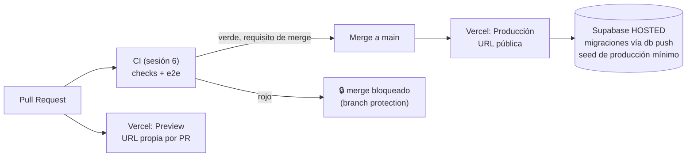

# MercadoTech — Sesión 7: Performance, Secretos y Despliegue en Vercel

## Este documento contiene la especificación completa de la sesión. Léelo completamente antes de generar cualquier código. No hagas suposiciones fuera de lo especificado.

> **Nota de numeración:** la antigua Fase 7.1 (pipeline de CI) se construyó en
> la sesión 6 como Fase 6.7 (decisión del docente, 2026-08-28) y ya corre en
> cada push/PR. Esta sesión lo consume: aquí se vuelve candado del merge
> (branch protection) y puerta del deploy. La numeración 7.2–7.5 se conserva.

**Prompts de la sesión (ejecutar en orden; versión completa y autocontenida de cada uno en `PROMPTS_sesion7.md`):**

0. "Ejecuta el Prompt 0 de `PROMPTS_sesion7.md`: verifica que la sesión 6 esté cerrada y el CI verde."
1. "Lee `mercadotech/MercadoTech_sesion7.md` completo y confírmame que entiendes el alcance. No generes código todavía."
2. "Ejecuta la Fase 7.2: optimización de performance y Core Web Vitals."
3. "Ejecuta la Fase 7.3: gobernanza de variables de entorno y secretos."
4. "Ejecuta la Fase 7.4: despliegue en Vercel con base de datos remota."
5. "Ejecuta la Fase 7.5: documentación final del proyecto."
6. "Ejecuta el Prompt de cierre de `PROMPTS_sesion7.md`: bitácora de la sesión en `docs/BITACORA.md` y actualización de `CLAUDE.md`."

---

## Objetivo general

Llevar MercadoTech de "funciona en mi máquina" a un producto desplegado:
performance medida y optimizada, gestión segura de secretos, despliegue
automático a Vercel con el CI de la sesión 6 como requisito de merge, y
documentación de nivel entrega.

## Objetivos específicos

* Medir y optimizar performance y Core Web Vitals con IA.
* Preparar variables de entorno seguras para producción.
* Conectar GitHub → Vercel (por interfaz) con previews por PR y deploy a producción por merge.
* Convertir el CI en candado: nada entra a `main` sin checks verdes.
* Documentar el proyecto con ayuda de Claude, a nivel de entrega.

---

## Qué vas a construir, en palabras simples

La tienda ya funciona, tiene red de seguridad y portero (sesión 6). Esta
sesión es **la mudanza del taller al local comercial**:

1. **Afinar la vitrina (performance, 7.2).** Antes de abrir al público se
   mide cuánto tarda la tienda en cargar en un celular normal, y se arregla lo
   que la medición señale — no lo que "suene bien optimizar". Primero el
   número, después el cambio, después el número otra vez.
2. **La caja fuerte (secretos, 7.3).** Las llaves (claves de Supabase, token
   de Hugging Face) nunca viajan en el código: se cargan **a mano en la
   interfaz de Vercel**, una por una, y queda escrito qué llave vive dónde y
   quién puede leerla. GitHub Actions no recibe ninguna (el CI de la sesión 6
   corre sin secretos, a propósito).
3. **El local con re-armado automático (deploy, 7.4).** Vercel se conecta al
   repositorio de GitHub **desde su propia interfaz** (sin CLI, sin tokens en
   el workflow): cada PR levanta un "local de ensayo" con URL propia (preview),
   y cada merge a `main` re-arma el local real (producción). Y se le pone
   candado a la puerta: GitHub no permite el merge si el portero de la sesión
   6 (los jobs `checks` y `e2e`) no dio verde.
4. **El manual del local (documentación, 7.5).** README de producto,
   arquitectura al día y el manual de despliegue con su plan de marcha atrás
   (rollback) — para que un desarrollador nuevo levante todo sin ayuda.

### Glosario mínimo

| Término | En una línea |
|---|---|
| Deploy / despliegue | Publicar la app en internet. En Vercel, cada uno queda numerado y se puede volver a él. |
| Preview deployment | Deploy temporal con URL propia que Vercel crea por cada PR — el "local de ensayo". |
| Producción | El deploy que ve el público, atado a la rama `main`. |
| Branch protection | Regla de GitHub: a `main` solo se entra por PR y con los checks del CI en verde. |
| Core Web Vitals | Las 3 métricas de experiencia que mide Google: LCP (cuánto tarda en verse lo principal), CLS (cuánto salta el layout), INP (cuánto tarda en responder al tacto). |
| Lighthouse | Auditor de performance integrado en Chrome (y en pagespeed.web.dev). Da nota de 0 a 100. |
| Bundle | El paquete de JavaScript que el navegador descarga. Más chico = más rápido. |
| `dynamic import` | Cargar un componente pesado solo cuando se necesita, en vez de en el bundle inicial. |
| Variable pública vs secreto | `NEXT_PUBLIC_*` viaja al navegador (no protege nada); un secreto solo vive en el servidor. Confundirlos es el error más caro de esta sesión. |
| `db push` | Aplicar las migraciones locales al proyecto Supabase hosted (el remoto NUNCA se edita a mano). |
| Smoke test | Recorrido corto post-deploy que confirma que lo vital respira. |
| Rollback | Volver al deploy anterior desde el dashboard de Vercel cuando el nuevo salió mal. |

---

## Antes de empezar: cuentas y accesos (tareas humanas, no de Claude)

Tres altas, todas gratuitas. Cada una se usa en el momento en que su fase lo
indica (no hace falta hacerlas todas antes del Prompt 0):

**A. Proyecto Supabase de PRODUCCIÓN (para la Fase 7.4):**
1. En https://supabase.com/dashboard → New project. Nombre `mercadotech-prod`,
   región cercana (São Paulo), y **guarda la contraseña de la base de datos**
   (se pide una sola vez; `db push` la necesitará).
2. Anota de Project Settings → API: la URL (`https://<ref>.supabase.co`), la
   clave publishable/anon y la clave secreta/service role.
3. NO crees tablas a mano: las migraciones del repo son la única fuente de
   verdad (las aplica la Fase 7.4).

**B. Cuenta de Vercel conectada a GitHub (para la Fase 7.4):**
1. https://vercel.com/signup → "Continue with GitHub" (misma cuenta del repo).
2. **Todo se hace por la interfaz de Vercel** (decisión del docente): importar
   el repo, cargar variables y desplegar. Sin CLI de Vercel, sin tokens en
   GitHub Actions. Los pasos exactos los da la Fase 7.4.

**C. Branch protection en GitHub (para la Fase 7.4):** es un ajuste manual en
Settings del repo; la Fase 7.4 trae los clics exactos.

Regla de oro transversal: **los valores de las claves nunca pasan por el chat
con Claude ni por el repo.** Claude te dirá QUÉ variable cargar y DÓNDE; los
valores los pegas tú, a mano, en la interfaz de Vercel.

---

## Estado de partida (validar con el Prompt 0 antes de empezar)

| Verificado (2026-08-31, tras el cierre de la S6) | Detalle | Lo usa la fase |
|---|---|---|
| **Sesión 6 COMPLETA y cerrada** (commits `f335433`…`c1da6e8`) | 293 tests unitarios (3 s, sin red), cobertura `services/` 89.89 %, validators + context-builder 100 % de ramas; CI verde en push y PR (`checks` 43–44 s); bitácora y CLAUDE.md al día | todas |
| **HALLAZGO ABIERTO de la S6: el kanban no es usable por teclado** | `OrdersKanban.tsx:86` registra `KeyboardSensor` SIN `coordinateGetter` (el default mueve 25 px por flecha; las columnas miden ~240 px). Sus 2 E2E están en `test.fixme`; el fix es 1 línea | 7.2 (lo cierra) |
| E2E: **14 specs — 12 verdes, 2 en `test.fixme`** por el hallazgo anterior | `seller-flow` (mover por teclado) y `seller-negative` (retroceso rechazado) esperan el fix | 7.2 |
| **El repo quedó PÚBLICO en GitHub** (la spec de la S6 pedía privado) | Consecuencia útil: branch protection disponible en el plan free (en repos privados exige plan de pago). Contrapartida: los greps anti-fuga de 7.3 son obligación, no higiene | 7.3, 7.4 |
| `packageManager: npm@11.6.2` + workflow con pin | la lección del lockfile ya está aplicada | 7.4 |
| `playwright.config.ts` acepta `PLAYWRIGHT_BASE_URL` | permite apuntar la suite E2E a un preview de Vercel (uso manual, opcional) | 7.4 |
| `next.config.ts` YA declara `remotePatterns` para `*.supabase.co` | las imágenes de producción no necesitan cambios de config | 7.2, 7.4 |
| `.env.example` YA completo y comentado (6 variables) | la auditoría de 7.3 parte de algo sano; el foco es la tabla de gobernanza | 7.3 |
| Fuentes ya con `next/font` (Geist, desde la sesión 2) | ese ítem clásico de performance ya está resuelto | 7.2 |
| CERO `dynamic import` en `app/` y `components/` | los candidatos pesados (chat, kanban, galería dnd) cargan en el bundle de su ruta | 7.2 |
| Build con **Turbopack** (`next build --turbopack`) | `@next/bundle-analyzer` (webpack) NO aplica; se mide con el resumen del build | 7.2 |
| README raíz = plan maestro del CURSO | escribir el README de producto sin destruir el plan | 7.5 |
| `docs/` con ARQUITECTURA (S2), BITACORA, RAG, DEBUGGING, REVISION_S5, ESTRUCTURA | ARQUITECTURA quedó en la era S2: no cuenta frontend, RAG, MCP ni testing | 7.5 |
| Supabase CLI 2.111 logueable (`supabase login` pendiente) | `link` + `db push` en 7.4 | 7.4 |
| Sesión 1 no ejecutada | modelo sugerido por fase vive en `PROMPTS_sesion7.md` | — |

### Decisiones tomadas al validar contra el repo

| # | Hallazgo | Resolución | Fase |
|---|---|---|---|
| 1 | La S6 cerró con un hallazgo abierto: falta `coordinateGetter` en el `KeyboardSensor` del kanban (los 2 E2E de la interacción más frágil del proyecto están en `fixme`) | Se cierra como PASO 0 de la Fase 7.2 — es un bug, no una feature (la restricción lo permite), y 7.2 va a tocar `OrdersKanban` con `dynamic import`: primero se completa su red de seguridad (fix de 1 línea + des-`fixme` + 14/14 E2E verdes), después se optimiza | 7.2 |
| 2 | **Directiva del docente:** Vercel se conecta a GitHub desde su interfaz y los secretos se cargan a mano en el dashboard de Vercel | Se ELIMINA la opción de deploy vía CLI/Actions que traía la spec anterior. GitHub Actions no recibe ningún secreto; el flujo es 100 % integración Git de Vercel | 7.4 |
| 3 | El build usa Turbopack: el bundle-analyzer clásico no funciona | Medir con el resumen de tamaños por ruta que imprime `next build` + Lighthouse; la garantía de que `lib/ai` no entra al cliente ya la dan `server-only` y los greps de arquitectura | 7.2 |
| 4 | No existe ningún `dynamic import` (verificado con grep) | Candidatos concretos ya identificados: `ChatWindow`, `OrdersKanban`, `SortableImageGallery` — se aplican SOLO si la medición del ANTES lo justifica | 7.2 |
| 5 | `next.config.ts` y `.env.example` ya están listos para producción | 7.2 y 7.3 NO los reescriben: 7.3 se concentra en la tabla de gobernanza (dónde vive cada variable) y los greps anti-fuga | 7.2, 7.3 |
| 6 | `seed.sql` es de laboratorio (usuarios con contraseña conocida, 16 productos falsos) — NO puede ir a producción | `supabase/seed.prod.sql` mínimo: 8 categorías + 10 artículos FAQ reales. SIN usuarios, SIN productos. El catálogo de producción nace VACÍO y eso es lo esperado | 7.4 |
| 7 | La FAQ de producción necesita sus embeddings para que `/soporte` responda | Tras el seed de prod, correr `scripts/index-all.ts` UNA vez apuntando a producción (env inline en el comando, sin tocar `.env.local`) | 7.4 |
| 8 | En Supabase hosted la confirmación de email viene ACTIVADA (en local está apagada) | Para el laboratorio: desactivar "Confirm email" en Authentication → Providers del proyecto prod (decisión documentada en DEPLOY.md; en un producto real se dejaría activada) | 7.4 |
| 9 | Los previews de Vercel necesitan una base de datos | Usan el MISMO proyecto Supabase de producción (un solo proyecto por alumno, plan free). Riesgo documentado: un preview toca datos reales — aceptable en el laboratorio, señalado como mejora en DEPLOY.md | 7.3, 7.4 |
| 10 | Cambiar una env var en Vercel NO afecta a los deploys ya hechos | Regla escrita: tras cambiar variables, redeploy. Va en DEPLOY.md y en la tabla de síntomas | 7.4 |
| 11 | El README raíz es el plan del curso, con valor propio | Se preserva moviéndolo a `docs/PLAN_CURSO.md` (intacto, con nota) y el README raíz pasa a ser el del producto | 7.5 |
| 12 | Lighthouse sobre `next dev` da números falsos (HMR, sin minificar) | Toda medición se hace contra build de producción: local `npm run build && npm run start`, y la final contra la URL real de Vercel | 7.2 |
| 13 | El repo quedó PÚBLICO (la S6 pedía privado) | Se MANTIENE público, documentado: habilita branch protection en el plan free de GitHub. A cambio, los greps anti-fuga de 7.3 se corren ANTES de cualquier push nuevo y el `docs/PLAN_CURSO.md` asume lectores externos | 7.3, 7.4 |

---

## Mapa de fases y dependencias

| Fase | Qué entrega (en una línea) | Depende de | Se verifica con |
|---|---|---|---|
| 7.2 | Hallazgo del kanban cerrado (14/14 E2E) + performance ANTES/DESPUÉS + `docs/PERFORMANCE.md` | Prompt 0 | los 2 `fixme` pasan; Lighthouse móvil ≥ 90 en home y catálogo (build de producción); suites verdes |
| 7.3 | Tabla de gobernanza de variables + greps anti-fuga en `docs/DEPLOY.md` (sección 1) | Prompt 0 | los greps devuelven vacío; la tabla cubre las 6 variables |
| 7.4 | BD hosted migrada + seed prod + Vercel conectado por UI + branch protection + smoke test | 7.2, 7.3 + tareas humanas A/B/C | PR de prueba: bloqueado en rojo, preview con URL, merge en verde → producción actualizada; smoke test completo |
| 7.5 | README de producto + ARQUITECTURA al día + DEPLOY.md completo (con rollback) | 7.4 | un desarrollador nuevo levanta el proyecto solo con el README (prueba guiada) |

## Convenciones transversales

* **Ningún secreto en el repo, en el chat, en logs de CI ni en el bundle.**
  Los valores se cargan a mano en la interfaz de Vercel (decisión 2). Claude
  maneja NOMBRES de variables, nunca valores.
* **Medir → cambiar → medir.** Ninguna optimización entra sin su número de
  antes y de después en `docs/PERFORMANCE.md` (decisión 12: siempre contra
  build de producción).
* **El remoto de Supabase solo se toca con `db push`** (migraciones del repo)
  y el SQL Editor para el seed de producción. Jamás cambios de esquema a mano.
* **No hay features nuevas en esta sesión**: se endurece y publica lo
  existente. Si algo aparece roto, es un bug (bitácora + fix), no una mejora.
* Los tests (sesión 6) son la red de seguridad de TODA la sesión: después de
  cada optimización de 7.2, la suite debe seguir verde.

---

# FASES

## Fase 7.1 — Pipeline de CI (GitHub Actions) — CONSTRUIDA EN LA SESIÓN 6

Ver `MercadoTech_sesion6.md`, Fase 6.7: `.github/workflows/ci.yml` (jobs
`checks` y `e2e`, Supabase efímero, sin secretos) ya corre en cada push/PR.
Aquí se consume: la Fase 7.4 lo vuelve requisito de merge.

## Fase 7.2 — Performance y Core Web Vitals

**Prompt sugerido:** "Ejecuta la Fase 7.2 de `MercadoTech_sesion7.md`."

### Qué se construye

Primero se salda la deuda de la sesión 6 (el kanban accesible por teclado,
con sus 2 E2E saliendo de `fixme`), y con la red de seguridad COMPLETA se
afina la vitrina con evidencia: números de partida, las optimizaciones que
esos números justifiquen, y los números finales — todo en
`docs/PERFORMANCE.md`.

### Depende de

Prompt 0 (sesión 6 cerrada; la suite de tests protege cada cambio).

### Paso 0 — cerrar el hallazgo abierto de la S6 (decisión 1)

`components/seller/OrdersKanban.tsx:86`: pasar el getter de dnd-kit al sensor —
`useSensor(KeyboardSensor, { coordinateGetter: sortableKeyboardCoordinates })`
(import de `@dnd-kit/sortable`; es el mismo patrón que la galería ya usa).
Quitar el `test.fixme` de los 2 E2E del kanban (`seller-flow` y
`seller-negative`) y correr la suite completa: **14/14 verdes**. Commit propio
(`fix:`) ANTES de cualquier optimización — así el `dynamic import` del kanban
del paso 2 queda protegido por sus tests.

### Archivos

| Archivo | Rol |
|---|---|
| `components/seller/OrdersKanban.tsx` | Paso 0: el `coordinateGetter` faltante (1 línea + 1 import). |
| `e2e/tests/seller-flow.spec.ts`, `seller-negative.spec.ts` | Paso 0: quitar los 2 `test.fixme`. |
| `docs/PERFORMANCE.md` | Metodología + tabla ANTES (por página y métrica) + optimización aplicada → porqué → tabla DESPUÉS. |
| `app/(shop)/producto/[id]/page.tsx` y componentes de chat/kanban/galería | ÚNICOS candidatos a cambio: `dynamic import` de `ChatWindow`, `OrdersKanban`, `SortableImageGallery` (decisión 4) — SOLO si el ANTES lo justifica. |
| Componentes con `ProductImage` | Ajustes de `sizes` correctos y `priority` solo en la portada above-the-fold de la home. |

### Reglas

* **Medición del ANTES** (decisión 12): `npm run build` y registrar el resumen
  de tamaños por ruta (First Load JS); luego `npm run start` y Lighthouse
  móvil (DevTools o pagespeed.web.dev) sobre home, detalle de producto y
  `/asistente`. Nada de medir sobre `next dev`.
* **Sin bundle-analyzer** (decisión 3, Turbopack): la dieta del bundle se
  decide con el resumen del build; la ausencia de `lib/ai` en el cliente ya
  la garantizan `server-only` + los greps del CLAUDE.md (correrlos y anotar).
* Cada optimización aplicada lleva su justificación numérica; una
  optimización sin diferencia medible se REVIERTE (queda anotada como
  intentada).
* Objetivos: LCP < 2.5 s, CLS < 0.1, INP < 200 ms (móvil simulado),
  Lighthouse Performance ≥ 90 en home y catálogo.
* Después de CADA cambio: `npm run test` y, al final, `npm run test:e2e`
  (los dynamic imports pueden romper hidratación — los E2E lo cazan).

### Cómo verificar al terminar

1. Paso 0 primero: `npm run test:e2e` reporta **14/14** (los 2 ex-`fixme`
   incluidos) y en el reporte se ve la tarjeta movida por teclado.
2. `docs/PERFORMANCE.md` con las dos tablas y cada cambio justificado.
3. Lighthouse móvil ≥ 90 en home y catálogo contra `npm run start` (capturas
   o puntajes anotados).
4. `npm run test`, `npm run test:e2e` y `npm run build` verdes.

## Fase 7.3 — Gobernanza de variables de entorno y secretos

**Prompt sugerido:** "Ejecuta la Fase 7.3 de `MercadoTech_sesion7.md`."

### Qué se construye

El inventario de llaves y su caja fuerte: qué variable vive dónde, quién la
lee, cuál es pública y cuál secreta — más los greps que prueban que ninguna
llave vive en el código.

### Depende de

Prompt 0. (`.env.example` ya está completo — decisión 5: esta fase NO lo
reescribe, lo audita.)

### Archivos

| Archivo | Rol |
|---|---|
| `docs/DEPLOY.md` (sección "Variables y secretos") | La tabla de gobernanza (abajo) + reglas escritas + resultado de los greps. |

**Tabla de gobernanza** (una fila por variable):

| Variable | Dónde vive | Quién la lee | Pública/Secreta |
|---|---|---|---|
| `NEXT_PUBLIC_SUPABASE_URL` | Vercel (Production + Preview), a mano | navegador y servidor | pública |
| `NEXT_PUBLIC_SUPABASE_ANON_KEY` | Vercel (ambos entornos), a mano | navegador y servidor (RLS gobierna) | pública |
| `SUPABASE_SERVICE_ROLE_KEY` | Vercel (ambos), a mano — solo runtime de servidor | `admin.ts` en Route Handlers | **SECRETA** |
| `HUGGINGFACEHUB_API_TOKEN` | Vercel (ambos), a mano | `lib/ai/` vía Route Handlers | **SECRETA** |
| `NEXT_PUBLIC_SITE_URL` | Vercel, por entorno (prod = URL real; preview = auto) | redirects de auth | pública |
| `HUGGINGFACE_*_MODEL` (opcionales) | Vercel solo si se necesita rotar modelo | `lib/ai/` | pública |

Y la fila que NO existe a propósito: **GitHub Actions — ninguna variable,
ningún secreto** (decisión 2; el CI corre contra el stack efímero).

### Reglas

* Reglas escritas en la sección: nunca commitear `.env*.local` (ya en
  `.gitignore` — verificar); rotación inmediata si una clave se expone
  (dashboard de Supabase / de Hugging Face); los previews comparten el
  proyecto de producción (decisión 9, con su riesgo señalado); tras cambiar
  una variable en Vercel → redeploy (decisión 10).
* Greps anti-fuga (pegar resultado, deben dar vacío): buscar en el código
  `hf_` (tokens HF), `sb_secret`, `eyJ` (JWT legacy) y el ref del proyecto
  hosted — excluyendo `node_modules`, lockfiles y esta documentación.

### Cómo verificar al terminar

1. La sección de DEPLOY.md existe con tabla + reglas + greps en vacío.
2. `git log --all -p -- .env.local` no muestra nada (nunca se commiteó).

## Fase 7.4 — Despliegue en Vercel con base de datos remota

**Prompt sugerido:** "Ejecuta la Fase 7.4 de `MercadoTech_sesion7.md`."

### Qué se construye

La tienda abierta al público: base de datos hosted migrada y sembrada,
Vercel conectado al repo por su interfaz, el candado en `main`, y la prueba
de fuego del flujo completo (PR → preview → merge → producción → smoke test).

### Depende de

7.2 y 7.3 + tareas humanas A (Supabase prod), B (Vercel) y C (branch
protection). Es la fase con más pasos manuales del curso: Claude prepara,
verifica y documenta; los clics en dashboards los das tú.

### Archivos y pasos

| Paso | Quién | Qué |
|---|---|---|
| 1. `supabase/seed.prod.sql` | Claude | Seed mínimo de producción: 8 categorías + 10 artículos FAQ reales (pueden reutilizarse los del seed de laboratorio: son contenido real). SIN usuarios, SIN productos, SIN pedidos (decisión 6). Cabecera que explica por qué. |
| 2. Migrar la BD hosted | Tú + Claude | `supabase login` (abre navegador) → `supabase link --project-ref <ref>` (pide la contraseña guardada en la tarea A) → `supabase db push`. Verificar en el dashboard: 15 tablas, RLS activa, buckets creados. |
| 3. Sembrar producción | Tú | Pegar `seed.prod.sql` en el SQL Editor del dashboard y ejecutarlo (una vez). |
| 4. Indexar la FAQ de prod | Claude | Correr `scripts/index-all.ts` UNA vez con las env de producción pasadas inline en el comando (decisión 7 — sin tocar `.env.local`); verificar 10 filas en `knowledge_embeddings` del dashboard. |
| 5. Auth de prod | Tú | Authentication → Sign In / Providers → desactivar "Confirm email" (decisión 8, documentada). |
| 6. Importar en Vercel | Tú | Add New → Project → Import `growlearnjo/mercadotech` → framework Next.js detectado → ANTES de "Deploy": cargar las 5-6 variables de la tabla de 7.3, a mano, marcándolas para Production y Preview → Deploy. |
| 7. Verificar el primer deploy | Claude guía, tú navegas | La URL `*.vercel.app` carga; si el build falla, la tabla de síntomas manda. |
| 8. Branch protection | Tú | GitHub → Settings → Branches → Add rule para `main`: ✔ Require a pull request before merging, ✔ Require status checks to pass (`checks` y `e2e`), ✔ Do not allow bypassing. |
| 9. Flujo completo demostrado | Tú + Claude | Rama `deploy-smoke` con un cambio visible trivial (ej. texto del footer) → PR → aparecen el CI y el Preview con URL propia → intentar merge con CI en curso (bloqueado) → CI verde → merge → producción muestra el cambio. |
| 10. Smoke test post-deploy | Tú, checklist de Claude | En la URL de producción: home carga (catálogo VACÍO con `EmptyState` — esperado, decisión 6); registrarse como vendedor real; publicar 1 producto demo con imagen; aparece en el catálogo; detalle abre; `/soporte` responde citando la FAQ (token cargado) o falla con el error controlado; logout/login; favicon correcto. Resultados a `docs/DEPLOY.md`. |

### Reglas

* Todo por la interfaz de Vercel (decisión 2): prohibido instalar la CLI de
  Vercel, crear tokens de deploy o agregar jobs de despliegue al workflow.
* Los valores de las claves NUNCA pasan por el chat: Claude indica nombre y
  entorno; tú pegas el valor (regla de oro de la cabecera).
* El seed de laboratorio (`seed.sql`) JAMÁS se ejecuta contra producción.
* Ningún test (unit ni E2E) apunta al Supabase de producción. El opcional
  documentado: correr la suite E2E contra un preview con
  `PLAYWRIGHT_BASE_URL=<url>` queda ANOTADO en DEPLOY.md como herramienta
  manual, no como parte del CI.

### Cómo verificar al terminar

1. El PR de `deploy-smoke` muestra: checks bloqueando el merge, preview con
   URL propia, y tras el merge la producción refleja el cambio.
2. Smoke test completo documentado en `docs/DEPLOY.md` con sus ✅.
3. En el dashboard de Supabase prod: 15 tablas, 10 FAQ, 10 embeddings, y el
   producto demo del smoke con su imagen en Storage.

## Fase 7.5 — Documentación final

**Prompt sugerido:** "Ejecuta la Fase 7.5 de `MercadoTech_sesion7.md`."

### Qué se construye

El manual del local: README de producto, arquitectura que refleja lo
construido (no el plan), y el manual de despliegue terminado con su plan de
marcha atrás.

### Depende de

7.4 (la URL de producción existe y se documenta).

### Archivos

| Archivo | Rol |
|---|---|
| `docs/PLAN_CURSO.md` | El contenido ACTUAL del README raíz, movido intacto con una nota de contexto (decisión 11). |
| `README.md` | De producto: qué es MercadoTech, stack, diagrama de capas, flujo RAG (reutilizar el de la spec 4), puesta en marcha local paso a paso (Docker + `supabase start` + `.env.local` + seed + `npm run dev`), comandos, testing (unit y E2E con su prerrequisito), deploy (resumen + link a DEPLOY.md), URL de producción, estructura del proyecto comentada. |
| `docs/ARQUITECTURA.md` | ACTUALIZAR: hoy documenta solo la era S2 (BD + RLS). Debe sumar frontend (S3), RAG (S4), Skills + MCP (S5), testing + CI (S6) y deploy (S7) — la realidad, no el plan; si el código difiere de alguna spec, gana el código con nota. |
| `docs/DEPLOY.md` | COMPLETAR: variables (7.3) + flujo (7.4) + smoke tests + **rollback**: cómo volver al deploy anterior desde el dashboard de Vercel (Deployments → ⋯ → Promote/Redeploy), cuándo usarlo, y qué NO revierte (la base de datos — las migraciones no se deshacen con un rollback de Vercel; anotarlo). |

### Reglas

* README para un desarrollador nuevo: cada comando copiable, cero contexto
  del curso asumido (el curso vive en `docs/PLAN_CURSO.md`).
* `CLAUDE.md` NO se toca aquí: lo actualiza el Prompt de cierre, verificando
  de paso que no afirme nada ya falso (lección ReadHub: su CLAUDE.md decía
  "no hay tests" cuando ya había suite completa).
* No duplicar: ARQUITECTURA enlaza a RAG.md, DEBUGGING.md y mcp/README.md en
  vez de re-explicarlos.

### Cómo verificar al terminar

1. Prueba del desarrollador nuevo (guiada): seguir el README desde cero en
   una terminal limpia — cada comando existe y el orden funciona.
2. ARQUITECTURA menciona las 5 capas nuevas post-S2 y la URL de producción.
3. DEPLOY.md responde tres preguntas sin ayuda: ¿dónde vive cada clave?,
   ¿cómo despliego un cambio?, ¿cómo vuelvo atrás?

---

## Si algo falla: síntomas y diagnóstico

| Síntoma | Causa más probable | Qué hacer |
|---|---|---|
| El build falla en Vercel pero local pasa | Falta una env var (las `NEXT_PUBLIC_*` se necesitan EN BUILD) o versión de Node distinta | Revisar las 6 variables en Project Settings → Environment Variables; alinear Node en Settings → General con la local (24) |
| "Invalid API key" / auth rota en producción | Clave pegada con espacios, de OTRO proyecto, o env cambiada sin redeploy (decisión 10) | Re-pegar la clave desde el dashboard de Supabase prod → Redeploy |
| Registro en prod no inicia sesión | "Confirm email" activo (hosted lo trae ON — decisión 8) | Desactivarlo en Authentication → Providers, o confirmar el usuario a mano en el dashboard |
| `/soporte` responde "no encontré información" en prod | FAQ sembrada pero SIN indexar (decisión 7) | Correr `scripts/index-all.ts` con las env de prod inline; verificar 10 embeddings |
| El chat falla en prod con error de proveedor | Token HF no cargado en Vercel, o el modelo gratuito rotó | Cargar `HUGGINGFACEHUB_API_TOKEN` + redeploy; si es rotación: `HUGGINGFACE_CHAT_MODEL` (tabla de síntomas de `docs/RAG.md`) |
| Imágenes rotas en producción | El producto demo aún no tiene imagen subida, o el path no es de prod | `ProductImage` muestra placeholder (esperado con catálogo nuevo); verificar el bucket en el dashboard |
| Lighthouse da 60 en local y nadie entiende | Se midió sobre `next dev` (decisión 12) | Medir SIEMPRE contra `npm run build && npm run start` o la URL de Vercel |
| El merge no se bloquea aunque el CI esté rojo | Branch protection sin los checks marcados, o regla que permite bypass | Revisar la regla: ambos checks (`checks`, `e2e`) requeridos y sin bypass |
| `db push` pide contraseña y no la tienes | Es la del paso "New project" (tarea A) | Resetearla en Project Settings → Database → Reset database password |
| Un preview rompió datos de producción | Decisión 9 asumida (BD compartida) | Restaurar a mano lo tocado; el riesgo está documentado — en un producto real: proyecto de staging aparte |

---

## Restricciones de la sesión

* No introducir features nuevas — esta sesión endurece y publica lo existente.
* Ningún secreto en el repositorio, en el chat, en logs de CI ni en el bundle
  cliente; nada de secretos en GitHub Actions (decisión 2).
* Sin CLI de Vercel ni jobs de deploy en el workflow: la integración Git de
  Vercel es la única vía (decisión 2).
* No apuntar tests (unit ni E2E) al Supabase de producción.
* No desplegar sin el CI verde; no mergear sin los checks.
* El seed de laboratorio jamás toca producción (decisión 6).
* No adelantar nada de voz (sesión 8).

## Entregables

1. Branch protection activa: `checks` y `e2e` obligatorios para merge a `main`.
2. `docs/PERFORMANCE.md` con métricas antes/después y objetivos alcanzados.
3. `docs/DEPLOY.md` completo (variables, flujo, smoke tests, rollback).
4. App desplegada en Vercel (URL de producción + previews por PR) sobre la BD hosted migrada y sembrada con `seed.prod.sql`.
5. `README.md` de producto + `docs/PLAN_CURSO.md` + `docs/ARQUITECTURA.md` al día.
6. Bitácora y `CLAUDE.md` actualizados (Prompt de cierre).

## Criterios de aceptación de la sesión

* El hallazgo del kanban está cerrado: los 2 E2E salieron de `fixme` y la
  suite E2E reporta 14/14.
* Un PR de prueba: CI + preview con URL propia; merge BLOQUEADO en rojo y
  permitido en verde; el merge actualiza producción.
* La URL de producción pasa el smoke test completo (incluido publicar un
  producto demo y el asistente de soporte citando la FAQ).
* Lighthouse ≥ 90 en Performance para home y catálogo (móvil, build de
  producción).
* Un desarrollador nuevo puede levantar el proyecto solo con el README.
* `npm run lint`, `type-check`, `test` y `build` verdes al cierre.

---

## Registro de cambios de esta versión de la spec (2026-08-31, rev. 2)

**Rev. 2 (tras el cierre real de la sesión 6):** el Prompt 0 deja de ser
bloqueante (la 6.8 y el cierre S6 ya corrieron, commits `e49f6ee`–`c1da6e8`);
el hallazgo abierto del kanban (falta `coordinateGetter`, 2 E2E en `fixme`)
se absorbe como Paso 0 de la Fase 7.2 (decisión 1 reescrita); se documenta
que el repo quedó público y sus consecuencias (decisión 13); Estado de
partida actualizado con los números reales de la S6 (293 unitarios,
89.89 % en services, 14 E2E con 2 en `fixme`).

Validación original contra el repositorio y las directivas del docente:

* **Directiva nueva incorporada:** el despliegue es 100 % por la interfaz de
  Vercel (integración Git) y los secretos se cargan a mano en su dashboard;
  se eliminó la opción de deploy vía CLI/Actions de la versión anterior.
  GitHub Actions sigue sin recibir ningún secreto.
* **Estructura:** mismo patrón de las sesiones 3–6 (skill
  `planificacion-por-fases`): Estado de partida, 12 decisiones de validación,
  mapa de fases, cinco secciones por fase, troubleshooting, registro de cambios,
  Prompt 0 y Prompt de cierre. Numeración 7.2–7.5 conservada (7.1 vive en la
  sesión 6 como 6.7).
* **Capa didáctica nueva:** analogía de la mudanza al local comercial,
  glosario, diagrama del flujo PR→preview→merge→producción, las tres tareas
  humanas con pasos, y la regla de oro de los secretos.
* **Anclas al repo real:** `next.config.ts` y `.env.example` ya listos (no se
  reescriben); sin bundle-analyzer por Turbopack; candidatos de `dynamic
  import` identificados; README del curso preservado en `docs/PLAN_CURSO.md`;
  seed de producción mínimo con FAQ indexada aparte; confirmación de email
  del hosted contemplada; previews sobre la BD de prod como riesgo documentado.
* **Sin cambios de alcance funcional** más allá de la directiva de Vercel:
  mismos objetivos de performance, misma gobernanza de secretos, mismo flujo
  de deploy y documentación.
