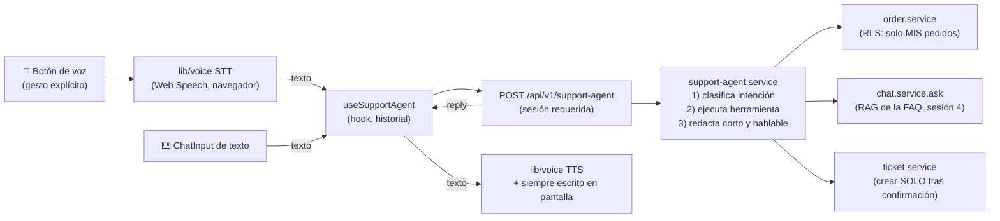

# MercadoTech — Sesión 8: Agente de Voz de Soporte, Demo Final y Roadmap

## Este documento contiene la especificación completa de la sesión. Léelo completamente antes de generar cualquier código. No hagas suposiciones fuera de lo especificado.

**Prompts de la sesión (ejecutar en orden; versión completa y autocontenida de cada uno en `PROMPTS_sesion8.md`):**

0. "Ejecuta el Prompt 0 de `PROMPTS_sesion8.md`: verifica el terreno y las tareas humanas del go-live."
1. "Lee `mercadotech/MercadoTech_sesion8.md` completo y confírmame que entiendes el alcance. No generes código todavía."
2. "Ejecuta la Fase 8.0: el go-live pendiente de la sesión 7."
3. "Ejecuta la Fase 8.1: capa de abstracción de voz (`lib/voice/`) y `useVoice`."
4. "Ejecuta la Fase 8.2: tickets completos y orquestador del agente de soporte."
5. "Ejecuta la Fase 8.3: centro de soporte con voz (UI)."
6. "Ejecuta la Fase 8.4: integración final, tests y deploy del agente."
7. "Ejecuta la Fase 8.5: guion de demo y roadmap de especialización."
8. "Ejecuta el Prompt de cierre de `PROMPTS_sesion8.md`: bitácora final en `docs/BITACORA.md` y actualización de `CLAUDE.md`."

---

## Objetivo general

Culminar MercadoTech convirtiendo el asistente de soporte (texto, sesión 4) en
un **agente de voz**: el usuario habla, el agente entiende la intención, usa
herramientas reales de la plataforma (estado de pedido, FAQ, tickets) y
responde hablando. Antes, se ejecuta el go-live que la sesión 7 dejó escrito.
Cierre con integración total, demo en vivo y roadmap.

Este es el módulo del curso de "agentes autónomos": el agente decide QUÉ
herramienta usar, pero cada acción con efectos (crear ticket, escalar) exige
confirmación explícita del usuario.

## Objetivos específicos

* Ejecutar el go-live pendiente (URL de producción + branch protection + smoke).
* Implementar STT y TTS detrás de una interfaz intercambiable (`VoiceProvider`).
* Construir un orquestador de agente con detección de intención y herramientas.
* Mantener la independencia de capas: la voz es ENTRADA/SALIDA de navegador,
  el agente es un SERVICE de servidor, y ninguno conoce al otro por dentro.
* Preparar y ejecutar la demo final; definir el roadmap.

---

## Qué vas a construir, en palabras simples

Hoy el soporte de MercadoTech es un chat que responde con la FAQ. Esta sesión
lo convierte en **una recepcionista con auriculares**:

1. **Escucha** (STT): mantienes presionado el botón del micrófono, hablas, y
   tu voz se convierte en texto — con la transcripción apareciendo en vivo.
2. **Decide a qué mostrador ir** (el orquestador): con lo que dijiste, el
   agente clasifica tu *intención* — ¿preguntas por un pedido?, ¿es una duda
   de la FAQ?, ¿quieres reclamar?, ¿pides un humano? — y usa la herramienta
   correcta de la plataforma. No inventa: consulta los mismos services que ya
   usa la web, con tu sesión y la RLS de siempre.
3. **Nunca firma por ti** (guardrails): consultar tu pedido es directo (solo
   lectura), pero crear un reclamo o escalar a un humano SIEMPRE te propone
   un resumen y espera tu "sí" antes de hacerlo.
4. **Responde hablando** (TTS): la respuesta se lee en voz alta Y queda
   escrita. Todo lo que se puede hacer por voz se puede hacer por texto en la
   misma pantalla — la voz es un acelerador, no un requisito. En Firefox (que
   no tiene reconocimiento de voz) la página funciona 100 % por texto.

La regla arquitectónica que gobierna todo: **el agente no sabe que existe la
voz** — recibe texto y devuelve texto; la voz es transporte. Por eso el mismo
orquestador serviría mañana para WhatsApp o una app móvil sin tocarlo.

### Glosario mínimo

| Término | En una línea |
|---|---|
| STT (speech-to-text) | Convertir voz en texto. Aquí: `SpeechRecognition` del navegador. |
| TTS (text-to-speech) | Convertir texto en voz. Aquí: `speechSynthesis` del navegador. |
| Web Speech API | Las dos capacidades anteriores, integradas gratis en Chrome/Edge. Firefox no trae STT. |
| `VoiceProvider` | La interfaz que envuelve la API de voz: cambiar a Whisper/ElevenLabs mañana = tocar solo `lib/voice/`. |
| Orquestador | El service que dirige cada turno: clasifica la intención, elige la herramienta, redacta la respuesta. |
| Intención | La etiqueta de qué quiere el usuario (`consulta_pedido`, `pregunta_faq`, `crear_reclamo`, `hablar_humano`, `fuera_de_alcance`). |
| Herramienta (tool) | Función interna del orquestador que REUTILIZA un service existente. El agente jamás toca Supabase directo. |
| Guardrail | Regla dura del agente: no inventar datos, no prometer reembolsos, no actuar sin confirmación. |
| Confirmación explícita | El "¿confirmas?" obligatorio antes de toda acción con efectos. Se responde en el turno siguiente. |
| Push-to-talk | El micrófono solo escucha mientras el usuario lo activa con un gesto. Nada de escucha continua. |
| Máquina de estados | Los modos de la UI de voz: `idle → listening → processing → speaking → idle` (+ `error`). |
| Degradación | Sin soporte de voz o sin permiso de micrófono, la página sigue funcionando completa por texto. |
| Contexto seguro | El micrófono solo funciona en `https` o `localhost` — otra razón por la que el go-live va primero. |

---

## Estado de partida (validar con el Prompt 0 antes de empezar)

| Verificado (2026-09-02) | Detalle | Lo usa la fase |
|---|---|---|
| Sesiones 2–7 ejecutadas y cerradas (cierre S7 = `5d83f24`) | 293 unitarios; **13/13 E2E** (el kanban accesible se arregló en la 7 y el test del defecto se borró); CI verde; bitácora al día | todas |
| **GO-LIVE PENDIENTE de la sesión 7** | No hay URL de producción, ni branch protection, ni smoke test. TODO está escrito paso a paso en `docs/DEPLOY.md` §2, y la rama `deploy-smoke` (commit `571e10c`) espera sin publicar | 8.0 |
| `services/ticket.service.ts` YA existe, solo con `listMine` | Su cabecera anuncia: "crear tickets llega con el agente (sesión 8)". Se AMPLÍA, no se crea. `types/ticket.ts` y `useMyTickets` también existen | 8.2 |
| `lib/constants/support.ts` YA existe (labels y colores de estado de ticket) | Los tunables nuevos del agente se agregan AHÍ | 8.2 |
| `SUPPORT_SYSTEM_INSTRUCTIONS` ya es "corta y hablable" | El comentario de la sesión 4 lo anticipó: "la sesión 8 agrega voz sobre este mismo modo" | 8.2 |
| `components/chat/` completo y reutilizable | `ChatWindow` (acepta sugerencias, placeholder, onSend), `ChatMessage`, `SourcesList`, `LoadingMessage` | 8.3 |
| `app/(shop)/soporte/page.tsx` compone `useChat("soporte")` + "Mis tickets" | Con el comentario "la sesión 8 amplía este layout con el botón de micrófono" | 8.3 |
| `order.service.getOrderById` y `listMyOrders` con cliente de sesión | La herramienta de pedidos reutiliza AMBOS (ver decisión 2) | 8.2 |
| `lib/voice/` vacío (solo `.gitkeep`); cero `data-testid` en soporte/chat | 8.1 lo puebla; 8.4 agrega los testids del E2E | 8.1, 8.4 |
| Deuda principal documentada (bitácora S7): catálogo client-side ≈ 3.9 s de Load Delay → Lighthouse < 90 | NO se resuelve aquí (cambia el contrato de capas); va al roadmap | 8.5 |
| Sesión 1 no ejecutada: no existe `docs/COSTOS.md` | La "retrospectiva de costos" de la spec original se ajusta (decisión 8) | 8.5 |

### Decisiones tomadas al validar contra el repo

| # | Hallazgo | Resolución | Fase |
|---|---|---|---|
| 1 | El go-live de la 7 no se ejecutó y la voz lo necesita doblemente: la demo exige URL real y el micrófono exige contexto seguro (`https`) | **Fase 8.0 nueva**: ejecutar el go-live siguiendo `docs/DEPLOY.md` §2 tal como está escrito (no se re-redacta), publicar y mergear `deploy-smoke`, smoke test completo | 8.0 |
| 2 | La spec original pedía "extraer el nº de pedido del texto" — pero los ids son **UUIDs impronunciables**: nadie dicta `c0000000-…` por voz | La herramienta `consulta_pedido` resuelve por CONTEXTO: parte de `listMyOrders` del usuario; "mi último pedido" → el más reciente; referencias como "el de la laptop" → match contra `title_snapshot`; ante ambigüedad, el agente ENUMERA (fecha + primer ítem + estado, hablable) y pide elegir. Jamás pide un UUID | 8.2 |
| 3 | `ticket.service.ts`, `types/ticket.ts`, `useMyTickets` y `lib/constants/support.ts` ya existen | Se AMPLÍAN conservando nombres (`listMine` se queda; no se renombra a `listMyTickets` como decía la spec original) | 8.2 |
| 4 | CLAUDE.md dice "la UI nunca importa `lib/voice/`" — pero la Web Speech API SOLO corre en el navegador (no hay salto a servidor posible, a diferencia de `lib/ai/`) | Cadena sancionada para voz: componente → `hooks/useVoice.ts` → `lib/voice/`. Los componentes siguen sin importarlo directo. Grep nuevo de gobernanza: `grep -rl "lib/voice" components` → vacío (solo `hooks/useVoice.ts` lo importa). El Prompt de cierre lo lleva a CLAUDE.md | 8.1 |
| 5 | La sesión 5 anotó que el agente de voz "reutilizaría `get_order_status` del MCP" | Se reutiliza el MISMO service subyacente (`order.service`), no la tool MCP: el orquestador corre dentro de Next y no habla MCP. La tool queda para clientes MCP externos; se aclara para que nadie intente conectar Next → MCP | 8.2 |
| 6 | Los tipos de `SpeechRecognition` no vienen en el `lib.dom` estándar de TypeScript | Declaraciones ambient mínimas dentro de `lib/voice/` (sin dependencias nuevas); comentadas | 8.1 |
| 7 | El turno del agente hace DOS llamadas al LLM gratuito (clasificar + redactar) — latencia y cuota | Se acepta y se tunea: historial acotado (`AGENT_MAX_HISTORY_TURNS`), respuestas cortas (`AGENT_MAX_REPLY_CHARS`), y la clasificación con `max_tokens` mínimo. Todos en `lib/constants/support.ts` con su porqué | 8.2 |
| 8 | La spec original cerraba con "retrospectiva en `docs/COSTOS.md`" — archivo que nunca existió (sesión 1 no ejecutada) | No se fabrica un registro de gasto retroactivo: la retrospectiva del curso va como sección final de la bitácora (Prompt de cierre), honesta sobre lo que no se midió | 8.5 |
| 9 | La confirmación pendiente debe sobrevivir entre turnos sin base de datos | El endpoint devuelve `pending` (la acción propuesta) y el cliente lo ECHA DE VUELTA en el siguiente request; el orquestador decide con eso. Sin estado en servidor; tipado en `types/support.ts` | 8.2 |
| 10 | Cero `data-testid` en la página de soporte y en `components/chat/` | El E2E de soporte (modo texto) los agrega en 8.4 — solo atributos, regla de la sesión 6 | 8.4 |
| 11 | La voz no puede automatizarse en CI (permisos de micrófono; Web Speech no existe headless) | E2E SOLO en modo texto (entra al CI); la voz se verifica con la checklist manual de la demo. El porqué queda comentado en el spec E2E | 8.4 |

---

## Mapa de fases y dependencias

| Fase | Qué entrega (en una línea) | Depende de | Se verifica con |
|---|---|---|---|
| 8.0 | El go-live de la 7 ejecutado: URL de producción, branch protection, smoke ✓ | Prompt 0 + tareas humanas de `docs/DEPLOY.md` §2 | la URL pública pasa el smoke test; un PR queda bloqueado sin checks |
| 8.1 | `lib/voice/` (interfaces + Web Speech) + `useVoice` (máquina de estados) | 8.0 (https para probar en prod; localhost basta en dev) | página de prueba temporal: dictar y escuchar en Chrome; degradación limpia en Firefox |
| 8.2 | Tickets completos + orquestador con 5 intenciones + endpoint | ninguna de voz (el agente es texto puro) | `curl` por intención: pedido real, FAQ con fuentes, reclamo con confirmación en 2 turnos |
| 8.3 | `/soporte` con voz: push-to-talk, transcripción viva, TTS, paridad texto | 8.1 + 8.2 | hablar "¿cómo devuelvo un producto?" → respuesta hablada y escrita con fuentes |
| 8.4 | Tests del agente + E2E texto + Skills + CI verde + deploy del agente | 8.3 | suite completa verde local y en CI; smoke de producción incluye al agente |
| 8.5 | `docs/DEMO.md` (guion 10 min) + `docs/ROADMAP.md` | 8.4 | ensayo de la demo completado con el guion, sin improvisar |

## Convenciones transversales

* **La voz NUNCA ejecuta acciones con efectos sin confirmación explícita.**
  Consultar estado de pedido es directo (solo lectura); crear ticket y
  escalar exigen el "sí" del turno siguiente.
* **El agente solo ve datos del usuario autenticado**: cliente de SESIÓN +
  RLS en todas las herramientas. El cliente admin no aparece en esta sesión.
* **El agente no sabe que existe la voz** (frase obligatoria como comentario
  de cabecera del orquestador). La voz tampoco sabe qué es un agente:
  `lib/voice/` no importa services, `lib/ai/` ni React.
* **Micrófono solo por gesto explícito** + indicador visible mientras
  escucha. Nada de auto-start ni escucha continua.
* **Paridad texto/voz**: todo lo hablable es tecleable en la misma pantalla.
* Sin proveedores de voz de pago (la interfaz queda lista para enchufarlos).
* Respuestas del agente CORTAS y hablables: máx. ~2 frases + una pregunta.

---

# FASES

## Fase 8.0 — El go-live pendiente de la sesión 7

**Prompt sugerido:** "Ejecuta la Fase 8.0 de `MercadoTech_sesion8.md`."

### Qué se construye

Nada de código: se EJECUTA lo que la sesión 7 dejó escrito. Al terminar,
MercadoTech tiene URL pública, el merge a `main` está protegido por el CI, y
el smoke test pasó — el escenario real donde vivirá el agente de voz.

### Depende de

Prompt 0 (tareas humanas A/B/C de la sesión 7 listas: proyecto Supabase de
producción creado, cuenta de Vercel, acceso a Settings del repo).

### Archivos

| Archivo | Rol |
|---|---|
| `docs/DEPLOY.md` §2 | EL GUION — se sigue tal como está escrito, paso a paso, sin re-redactarlo. |
| rama `deploy-smoke` (commit `571e10c`) | Se publica (`git push -u origin deploy-smoke`), abre el PR de prueba y se mergea tras los checks. |
| `docs/DEPLOY.md` (checklist del smoke) | Se completa con los ✅ reales y la URL de producción. |

### Reglas

* Todo por las interfaces (Vercel/Supabase/GitHub) como manda la sesión 7:
  sin CLI de Vercel, sin secretos en Actions, valores de claves jamás por el
  chat.
* Si un paso del guion no coincide con la realidad del dashboard, se anota la
  desviación en el registro de cambios de la 7 — no se improvisa.

### Cómo verificar al terminar

1. La URL `*.vercel.app` pasa el smoke test completo de DEPLOY.md (incluido
   publicar el producto demo y el asistente de soporte citando la FAQ).
2. Un PR con el CI en rojo NO se puede mergear; en verde sí.
3. `git log origin/main` muestra el merge de `deploy-smoke`.

## Fase 8.1 — Capa de abstracción de voz y `useVoice`

**Prompt sugerido:** "Ejecuta la Fase 8.1 de `MercadoTech_sesion8.md`."

### Qué se construye

Los oídos y la boca, sin cerebro todavía: la interfaz `VoiceProvider`, su
implementación con Web Speech API, y el hook con la máquina de estados que
cualquier feature de voz futura podrá reutilizar.

### Depende de

8.0 opcionalmente (para probar en https); en dev, `localhost` es contexto
seguro suficiente.

### Archivos

| Archivo | Rol |
|---|---|
| `lib/voice/types.ts` | Las interfaces `SttProvider` (`isSupported`, `start({lang, onPartial})`, `stop(): Promise<string>`, `abort`) y `TtsProvider` (`isSupported`, `speak(text, {lang, rate})`, `cancel`) + declaraciones ambient de `SpeechRecognition` (decisión 6). |
| `lib/voice/web-speech-stt.ts` | STT con `SpeechRecognition`/`webkitSpeechRecognition`: permisos denegados → error tipado (no excepción suelta); resultados parciales para transcripción viva; `lang: es-PE` con fallback `es`. |
| `lib/voice/web-speech-tts.ts` | TTS con `speechSynthesis`: selección de la primera voz `es-*` disponible; troceo de textos largos (~200 chars — algunos motores cortan en silencio); `cancel` limpio. |
| `lib/constants/voice.ts` | `VOICE_LANG_DEFAULT = "es-PE"`, `VOICE_RATE`, `LISTEN_TIMEOUT_MS` (~8 s de silencio corta), `TTS_CHUNK_MAX_CHARS`. Cada uno con su porqué. |
| `hooks/useVoice.ts` | Máquina de estados `idle → listening → processing → speaking → idle` (+ `error` transversal). Expone `state`, `partialTranscript`, `startListening`, `stopListening`, `speak`, `cancel`, `isVoiceSupported`. NO llama al agente (independencia: lo compone la página). |

### Reglas

* Cadena de imports (decisión 4): SOLO `hooks/useVoice.ts` importa
  `lib/voice/`; ningún componente lo hace. `lib/voice/` no importa React,
  services ni `lib/ai/`.
* Documentar en `types.ts` cómo se enchufaría un provider alternativo
  (Whisper server-side / ElevenLabs) sin tocar UI ni agente.
* Sin dependencias npm nuevas.

### Cómo verificar al terminar

1. Página temporal `app/dev/voz/page.tsx` (se borra en 8.4): botón que dicta
   → muestra transcripción parcial y final; botón que lee un texto en
   español. Probado en Chrome.
2. En Firefox (o simulando `isSupported() = false`): la página lo dice
   claramente, sin errores de consola.
3. Denegar el permiso de micrófono → estado `error` con mensaje claro, y la
   página se recupera al reintentar.
4. `grep -rl "lib/voice" components hooks | grep -v useVoice` → vacío.

## Fase 8.2 — Tickets completos y orquestador del agente

**Prompt sugerido:** "Ejecuta la Fase 8.2 de `MercadoTech_sesion8.md`."

### Qué se construye

El cerebro, 100 % texto: los tickets ganan escritura, y el orquestador
clasifica la intención de cada turno, ejecuta la herramienta correcta
reutilizando los services existentes, y respeta las confirmaciones. Al
terminar se conversa con él por `curl`, antes de que exista la voz.

### Depende de

Nada de 8.1 (el agente es texto puro — esa es la gracia).

### Archivos

| Archivo | Rol |
|---|---|
| `services/ticket.service.ts` | AMPLIAR (decisión 3): `createTicket(userId, subject, firstMessage, channel)` (inserta ticket + primer `ticket_message` con `sender_role: 'usuario'`), `getTicketWithMessages(id)`, `addMessage(ticketId, senderRole, content)`, `closeTicket(id)` (la RLS solo permite al dueño ponerlo en `cerrado`). `listMine` se queda como está. |
| `lib/constants/support.ts` | AMPLIAR: `AGENT_INTENTS` (las 5 etiquetas), `AGENT_MAX_HISTORY_TURNS` (~6), `AGENT_MAX_REPLY_CHARS`, `INTENT_MAX_TOKENS` (clasificación barata — decisión 7). Con sus porqués. |
| `lib/ai/prompts.ts` | AMPLIAR: `INTENT_CLASSIFIER_INSTRUCTIONS` (salida FORZADA a una etiqueta de `AGENT_INTENTS`, sin prosa) y `SUPPORT_AGENT_INSTRUCTIONS` (guardrails: nunca inventar pedidos ni montos; nunca prometer reembolsos — eso lo decide un humano; máx. ~2 frases + una pregunta; siempre español; los datos de pedidos vienen SOLO de la herramienta). |
| `types/support.ts` | `AgentIntent`, `AgentTurnRequest {message, history, pending?}`, `AgentTurnResult {reply, intent, sources?, action?, pending?}` — `pending` implementa la confirmación sin estado en servidor (decisión 9). |
| `services/support-agent.service.ts` | EL ORQUESTADOR (cabecera obligatoria: "El agente no sabe que existe la voz: recibe texto, devuelve texto"). Por turno: (a) si hay `pending` y el mensaje confirma/niega → resolver; (b) clasificar intención con el LLM; (c) herramienta según la tabla de abajo; (d) redactar corto con `SUPPORT_AGENT_INSTRUCTIONS`. |
| `app/api/v1/support-agent/route.ts` | Sesión requerida (401); valida body; cliente de SESIÓN; log estructurado `{intent, hasAction, pendingType}` (observabilidad del agente); errores con `apiError`. |

**Tabla de herramientas** (todas reutilizan services existentes; el agente no toca Supabase directo):

| Intención | Herramienta | Regla clave |
|---|---|---|
| `consulta_pedido` | `order.service.listMyOrders` + `getOrderById` | Resolución por contexto, NUNCA por UUID hablado (decisión 2): "mi último pedido" → el más reciente; "el de la laptop" → match por `title_snapshot`; ambigüedad → enumerar hablable (fecha + primer ítem + estado) y preguntar. |
| `pregunta_faq` | `chat.service.ask(query, 'soporte')` | El pipeline RAG de la sesión 4 tal cual; las fuentes viajan en `sources`. |
| `crear_reclamo` | `ticket.service.createTicket` | En DOS turnos: primero propone `pending {subject, summary}` y pregunta "¿Confirmas que cree el reclamo con este resumen?"; solo ante confirmación crea, con `channel` según el transporte ('voz'/'chat'), y devuelve `action {type:'ticket_creado', ticketId}`. |
| `hablar_humano` | `ticket.service.createTicket` (asunto de escalamiento) | Mismo esquema de confirmación; la respuesta cita el tiempo estimado desde la FAQ. |
| `fuera_de_alcance` | ninguna | Lo dice honestamente y reencuadra qué SÍ puede hacer. |

### Reglas

* El historial que recibe el LLM se recorta a `AGENT_MAX_HISTORY_TURNS`
  (resuelve referencias como "¿y el otro pedido?" sin quemar cuota).
* La "reutilización del MCP" de la sesión 5 es del SERVICE subyacente, no de
  la tool: nada en Next llama al servidor MCP (decisión 5, en comentario).
* Sin token de Hugging Face, el endpoint degrada con el error accionable de
  `lib/ai/` — nunca un 500 sin mensaje.

### Cómo verificar al terminar

Con cookie de sesión de `buyer1` (que tiene pedidos en el seed), 5 `curl`:

1. "¿en qué estado está mi último pedido?" → intent `consulta_pedido`,
   estado real del pedido más reciente de buyer1, sin inventos.
2. "¿cómo devuelvo un producto?" → intent `pregunta_faq`, respuesta corta
   citando el artículo de devoluciones en `sources`.
3. "quiero reclamar porque mi laptop llegó rayada" → `pending` con el resumen
   propuesto, SIN ticket creado (verificar conteo en Studio).
4. El mismo request + historial + `pending` + mensaje "sí, confirmo" →
   `action.ticket_creado`, y el ticket aparece en Studio con su primer
   mensaje y `channel: 'chat'`.
5. "¿me venden un auto?" → `fuera_de_alcance`, honesto y reencuadrando.
6. Los logs del server muestran `{intent…}` por turno; sin cookie → 401.

## Fase 8.3 — Centro de soporte con voz (UI)

**Prompt sugerido:** "Ejecuta la Fase 8.3 de `MercadoTech_sesion8.md`."

### Qué se construye

La recepcionista completa: `/soporte` pasa del chat de FAQ al agente, con
push-to-talk, transcripción en vivo, respuestas habladas y paridad total con
el teclado.

### Depende de

8.1 (useVoice) + 8.2 (endpoint del agente).

### Archivos

| Archivo | Rol |
|---|---|
| `hooks/useSupportAgent.ts` | Historial en memoria + `pending` eco (decisión 9) + `sendMessage`; errores del servidor como mensaje inline del asistente (patrón de `useChat`, que queda intacto para `/asistente`). |
| `components/support/VoiceButton.tsx` | Push-to-talk (mantener o toggle): estados visuales de la máquina (`listening` con animación de onda, `processing`, `speaking`); deshabilitado con tooltip si `!isVoiceSupported`; badge "micrófono activo" mientras escucha. Puro: recibe estado y callbacks. |
| `components/support/LiveTranscript.tsx` | La transcripción parcial en vivo mientras el usuario habla. |
| `components/support/TicketCreatedCard.tsx` | Card "Ticket #… creado" con link, para los mensajes con `action`. |
| `components/chat/ChatWindow.tsx` | AMPLIAR con dos props opcionales y puras: `inputAccessory` (nodo junto al `ChatInput` — ahí vive el botón de voz) y soporte de `action` en los mensajes (renderiza la card). Sin lógica nueva. |
| `app/(shop)/soporte/page.tsx` | Componer: `useSupportAgent` + `useVoice` (aquí se encuentran, y solo aquí); cada respuesta se REPRODUCE por TTS (con botón silenciar/repetir) y siempre queda escrita; el `ChatInput` de texto sigue presente (paridad); "Mis tickets" ahora enlaza al detalle. |
| `app/(shop)/soporte/tickets/[id]/page.tsx` | Detalle del ticket con sus mensajes (`getTicketWithMessages`) y botón "Cerrar ticket" si está abierto. |

### Reglas

* La página es el ÚNICO punto donde voz y agente se encuentran (regla de la
  sesión 3: hooks ↔ componentes solo en páginas).
* El micrófono jamás se activa solo; al desmontar la página, `cancel()` de
  ambos (no dejar TTS hablando en otra ruta).
* Firefox / sin permiso: el botón explica por qué está deshabilitado y TODO
  funciona por texto.
* Los textos del flujo de confirmación se muestran tal cual los devuelve el
  agente — la UI no re-redacta al agente.

### Cómo verificar al terminar

1. En Chrome, hablando: "¿en qué estado está mi último pedido?" → respuesta
   hablada Y escrita con el estado real; "¿cómo devuelvo un producto?" →
   fuentes visibles; crear un reclamo por voz → el agente pide confirmación,
   se confirma HABLANDO, y el ticket aparece en "Mis tickets" con
   `channel: 'voz'`.
2. Silenciar y repetir funcionan; navegar a otra ruta corta el TTS.
3. En Firefox: misma página, 100 % por texto, botón de voz deshabilitado con
   tooltip.
4. `/soporte/tickets/[id]` muestra la conversación del ticket y permite
   cerrarlo (y la RLS impide cualquier otra edición).

## Fase 8.4 — Integración final, tests y deploy del agente

**Prompt sugerido:** "Ejecuta la Fase 8.4 de `MercadoTech_sesion8.md`."

### Qué se construye

El cierre de calidad de TODO el curso: tests del agente, E2E del soporte en
modo texto, las 4 Skills auditando el código nuevo, y el agente desplegado a
producción por el flujo de la sesión 7.

### Depende de

8.3 completa.

### Pasos y archivos

| Qué | Detalle |
|---|---|
| Tests unitarios del orquestador | `services/support-agent.service.test.ts`: con `vi.mock` de `lib/ai/*` y Supabase inyectado (patrón de la sesión 6): intención mockeada → herramienta correcta llamada; `crear_reclamo` SIN confirmación NO crea; con confirmación crea con el channel correcto; "mi último pedido" elige el más reciente; ambigüedad → enumeración. También `ticket.service.test.ts` para las funciones nuevas. |
| E2E de soporte (modo texto) | `e2e/tests/support-agent.spec.ts`: login buyer1 → pregunta de FAQ → fuentes visibles; flujo completo de reclamo con confirmación por TEXTO → card de ticket → aparece en Mis tickets → abrir detalle → cerrar. `data-testid` nuevos donde falten (decisión 10, solo atributos). Comentario obligatorio en el spec: por qué la voz NO se automatiza (decisión 11). |
| Recorrido completo manual | Todos los flujos (comprador, vendedor, asistentes, agente de voz) con `supabase db reset` + datos frescos. |
| Gobernanza | Correr las 4 Skills sobre `lib/voice/`, el orquestador y la UI nueva; corregir hallazgos (commits separados); cerrar con validator **APROBADA**. |
| Greps de independencia | `lib/voice/` no importa services/ai/React; el orquestador no importa `lib/voice/` ni React; components no importan `lib/voice` (solo `useVoice`); pegar resultados. |
| Limpieza | Borrar `app/dev/voz/` (8.1). |
| Deploy | Rama → PR (CI con los E2E nuevos) → merge → producción; smoke test ampliado: el agente responde en la URL real (la FAQ de prod ya está indexada desde la 8.0/7.4). |

### Cómo verificar al terminar

1. `npm run test` y `npm run test:e2e` verdes (13 + los nuevos, todos sin `fixme`).
2. CI verde en el PR del agente; producción actualizada tras el merge.
3. En la URL de producción, con Chrome: una consulta de pedido por voz
   responde con datos reales del usuario de prueba.
4. Salida del validator: VALIDACIÓN APROBADA.

## Fase 8.5 — Demo y roadmap

**Prompt sugerido:** "Ejecuta la Fase 8.5 de `MercadoTech_sesion8.md`."

### Qué se construye

El cierre del curso: un guion de demo ensayable minuto a minuto y el mapa de
lo que vendría después.

### Depende de

8.4 (todo desplegado y verde).

### Archivos

| Archivo | Rol |
|---|---|
| `docs/DEMO.md` | Guion de 10 minutos con URL, usuarios y datos EXACTOS: (1′) qué es + capas en una lámina; (2′) comprador: búsqueda semántica → detalle → carrito → checkout; (2′) vendedor: publicar con galería drag & drop → kanban; (1′) asesor de compras con fuentes; (3′) **clímax — agente de voz**: estado de pedido hablando, pregunta de FAQ, reclamo con confirmación por voz; (1′) bajo el capó: CI verde, tests, Skills, MCP en el Inspector. **Plan B escrito**: video corto pregrabado del flujo de voz + entorno local como respaldo del deploy. |
| `docs/ROADMAP.md` | Siguientes pasos con esfuerzo (S/M/L): **catálogo a Server Components** (la deuda principal medida: ~3.9 s de Load Delay, cambia la regla hooks→services — primera de la lista, con sus números); pagos reales (Stripe/Culqi) + webhooks; STT/TTS de producción (Whisper/ElevenLabs — solo `lib/voice/`); streaming de chat y TTS; chunking real del RAG (la tabla ya tiene `chunk_index`); agente del vendedor; notificaciones; app móvil reutilizando services; MCP como API pública autenticada. |

### Reglas

* Cada paso de la demo nombra el dato exacto (qué usuario, qué producto, qué
  frase decir) — "sin improvisar" es literal.
* La retrospectiva del curso NO va aquí (decisión 8): va en la bitácora del
  Prompt de cierre.

### Cómo verificar al terminar

1. Ensayo completo cronometrado siguiendo `docs/DEMO.md` al pie de la letra —
   si un paso requirió improvisar, se corrige el guion.
2. El plan B es ejecutable: el video existe y el entorno local levanta.

---

## Si algo falla: síntomas y diagnóstico

| Síntoma | Causa más probable | Qué hacer |
|---|---|---|
| El micrófono no pide permiso / no pasa nada | Contexto no seguro (http que no es localhost) o navegador sin `SpeechRecognition` | Probar en `localhost` o en la URL https; en Firefox es esperado: modo texto |
| `SpeechRecognition` da error `network` en Chrome | El STT de Chrome usa servicio en línea y no hay red | Reintentar con conexión; documentado en `lib/voice/` |
| El TTS se corta a mitad de frase | Motores que truncan ~200+ chars | El troceo de `web-speech-tts` (revisar `TTS_CHUNK_MAX_CHARS`) |
| El TTS sigue hablando al cambiar de página | Falta el `cancel()` en el desmontaje | Regla de la 8.3; revisar el efecto de limpieza |
| El agente inventa un pedido o un monto | El prompt permitió datos fuera de la herramienta | Los datos de pedidos SOLO vienen de la tool; reforzar `SUPPORT_AGENT_INSTRUCTIONS` y anclar con el test unitario |
| El agente crea el ticket sin preguntar | El flujo `pending` no se está echando de vuelta | Revisar que el hook reenvíe `pending` (decisión 9) y el test que lo cubre |
| "¿mi pedido?" responde con el pedido de otro | JAMÁS debería: cliente de sesión + RLS | Si pasa, es bug crítico: verificar que el endpoint usa el cliente de SESIÓN, no admin |
| Clasificación de intención errática | Etiquetas libres o historial gigante | Salida forzada a `AGENT_INTENTS`, `INTENT_MAX_TOKENS` mínimo, historial recortado |
| Latencia alta por turno | Dos llamadas al LLM gratuito (decisión 7) | Esperado; verificar tunables; el estado `processing` de la UI lo comunica |
| El E2E de voz "no se puede escribir" | Correcto: no existe (decisión 11) | La voz se verifica con la checklist de la demo; el E2E es de texto |
| El agente falla en prod pero local funciona | Token HF no cargado en Vercel o FAQ de prod sin indexar | Tabla de síntomas de la sesión 7 + verificar los 10 embeddings de prod |

---

## Restricciones de la sesión

* La voz NUNCA ejecuta acciones con efectos sin confirmación explícita;
  consultar estado de pedido sí es directo (solo lectura).
* El agente solo accede a datos del usuario autenticado (cliente de sesión +
  RLS); el cliente admin no se usa en esta sesión.
* Sin proveedores de voz de pago (la interfaz queda lista para ellos).
* El micrófono solo se activa por gesto del usuario; nada de escucha continua.
* No se resuelve la deuda del catálogo client-side (va al roadmap con sus
  números — cambia el contrato de capas y no cabe en el tiempo de demo).
* No agregar features fuera de este documento — el tiempo restante es para la
  demo.

## Entregables

1. Go-live ejecutado: URL de producción + branch protection + smoke ✓ (deuda de la 7 saldada).
2. `lib/voice/` completo (interfaces + Web Speech + constantes) y `useVoice`.
3. `ticket.service` completo, `support-agent.service` (orquestador) y su endpoint.
4. Centro de soporte con voz, accesible, con paridad texto/voz y detalle de tickets.
5. Tests del orquestador y tickets + E2E de soporte en modo texto, todo en CI.
6. Deploy final en producción con smoke test que incluye al agente.
7. `docs/DEMO.md` + `docs/ROADMAP.md`.
8. Bitácora final (con la retrospectiva del curso) y `CLAUDE.md` al día (Prompt de cierre).

## Criterios de aceptación de la sesión

* En Chrome: hablar "¿en qué estado está mi último pedido?" devuelve el
  estado real del pedido del usuario, hablado y escrito — sin dictar ningún id.
* Crear un reclamo por voz exige y respeta la confirmación; el ticket aparece
  en "Mis tickets" con `channel: 'voz'`.
* En Firefox (sin `SpeechRecognition`): la misma página funciona 100 % por texto.
* Todo el ciclo de calidad (lint, type-check, unit, E2E, Skills, CI) verde, y
  producción actualizada con el agente.
* Demo ejecutable de principio a fin siguiendo `docs/DEMO.md` sin improvisar.

---

## Registro de cambios de esta versión de la spec (2026-09-02)

Validación contra el repositorio (sesiones 2–7 cerradas; go-live pendiente) con
la skill `planificacion-por-fases`. Cambios respecto a la versión anterior:

* **Fase 8.0 nueva:** el go-live que la sesión 7 dejó escrito se ejecuta aquí
  (la demo necesita URL y el micrófono exige https) — sin re-redactar
  `docs/DEPLOY.md`, que es el guion.
* **Corrección de diseño obligatoria (decisión 2):** `consulta_pedido` ya no
  "extrae el nº de pedido del texto" — los ids son UUIDs impronunciables; la
  herramienta resuelve por contexto (`listMyOrders` + referencias + enumeración
  hablable).
* **Anclas al repo real:** `ticket.service`/`types/ticket`/`useMyTickets`/
  `lib/constants/support.ts` se AMPLÍAN (no se crean; `listMine` conserva su
  nombre); `ChatWindow` gana props opcionales en vez de duplicar chat; la
  cadena de imports de voz queda sancionada (componente → `useVoice` →
  `lib/voice/`, con su grep); la "reutilización del MCP" se aclara como
  reutilización del service subyacente; la confirmación viaja como `pending`
  eco sin estado en servidor; la retrospectiva de costos deja de apuntar a un
  `docs/COSTOS.md` que nunca existió.
* **Capa didáctica nueva:** analogía de la recepcionista con auriculares,
  glosario, diagrama del flujo, verificaciones en lenguaje de acciones
  (incluidos los 5 `curl` por intención) y tabla de síntomas.
* **Sin cambios de alcance funcional** salvo la Fase 8.0: mismas 5 intenciones,
  mismos guardrails, misma demo y roadmap (el roadmap ahora abre con la deuda
  medida del catálogo client-side).
