# Arquitectura de MercadoTech

Este documento describe **lo que existe hoy** en el repositorio al cierre de
la sesión 2 (infraestructura: proyecto Next.js, esquema de base de datos,
RLS, Storage, datos de prueba y validación). Está escrito para alguien que
se une al proyecto ahora mismo y no participó en las sesiones anteriores —
no asume ese contexto. No hay pantallas ni lógica de negocio todavía: eso
llega en la sesión 3.

## Tabla de contenidos

1. [Arquitectura general y capas](#1-arquitectura-general-y-capas)
2. [Organización de carpetas](#2-organización-de-carpetas)
3. [Modelo relacional](#3-modelo-relacional)
4. [Decisiones de diseño](#4-decisiones-de-diseño)
5. [Integración Next.js ↔ Supabase](#5-integración-nextjs--supabase)
6. [Flujo de autenticación](#6-flujo-de-autenticación)
7. [Estrategia de escalabilidad](#7-estrategia-de-escalabilidad)
8. [Políticas RLS](#8-políticas-rls)
9. [Qué sigue](#9-qué-sigue)

---

## 1. Arquitectura general y capas

MercadoTech es una aplicación Next.js 15 (App Router) sobre Supabase
(Postgres + Auth + Storage). La regla que gobierna todo el proyecto —
declarada en [`CLAUDE.md`](../CLAUDE.md) — es que cada capa tiene una única
responsabilidad y los datos fluyen en un solo sentido:

```
components/  →  hooks/  →  services/  →  lib/supabase/  →  Postgres (RLS)
   (UI pura)    (estado)   (negocio)      (3 clientes)
```

* **`components/`** — presentación pura. Reciben props, no hacen fetching,
  no conocen Supabase. **Hoy está vacía** (con `.gitkeep`): se llena en la
  sesión 3.
* **`hooks/`** — estado de cliente (React). Llaman a `services/`, no tienen
  lógica de negocio propia. **Vacía hoy.**
* **`services/`** — lógica de negocio. Cada función acepta un
  `SupabaseClient` inyectable, para que hooks y Route Handlers compartan la
  misma lógica y los tests la puedan mockear sin red. **Vacía hoy** — el
  único código de negocio que existe en la sesión 2 vive directamente en
  Postgres (la función `create_order_from_cart`, ver [§4](#4-decisiones-de-diseño)),
  porque el checkout necesita ser transaccional y no puede depender de que
  el cliente complete todos los pasos.
* **`lib/supabase/`** — los 3 (+1) clientes que hablan con Supabase. Es la
  única capa con código real en esta sesión; ver [§5](#5-integración-nextjs--supabase).
* **`lib/ai/`** y **`lib/voice/`** — vacías, reservadas para las sesiones 4
  y 8. La UI nunca las importa directamente ni al cliente admin.
* **`app/api/v1/`** — Route Handlers delgados, solo para lo que no puede
  correr en el navegador. **Vacía hoy** — no hay endpoints, todo el acceso a
  datos de las sesiones futuras pasa por Supabase con RLS, no por una API
  REST paralela.

No hay pasarela de pago real: el checkout es simulado (crea el pedido y
descuenta stock).

## 2. Organización de carpetas

```
mercadotech/
├── app/
│   ├── (auth)/, (shop)/, (seller)/   route groups vacíos — sesión 3
│   └── api/v1/                       vacío — Route Handlers de sesiones futuras
├── components/, hooks/, services/    vacíos — sesión 3
├── lib/
│   ├── supabase/     client.ts · server.ts · middleware.ts · admin.ts
│   ├── constants/    roles.ts (roles y estados del dominio)
│   ├── validators/   vacío — sesión 3
│   ├── ai/           vacío — sesión 4
│   └── voice/        vacío — sesión 8
├── types/            vacío — se llena con database.ts generado + tipos de dominio
├── supabase/
│   ├── migrations/   16 archivos, fuente de verdad del esquema (ver §3)
│   ├── schema.sql     copia de referencia (tablas + función), NO editable a mano
│   ├── policies.sql   copia de referencia (RLS + Storage), NO editable a mano
│   ├── seed.sql       datos de prueba (6 usuarios, 16 productos, 6 pedidos...)
│   └── tests/
│       └── rls-validation.sql   76 escenarios de RLS (Fase 2.6)
└── docs/
    └── ARQUITECTURA.md   este archivo
```

Las carpetas vacías existen ya (con `.gitkeep`) porque la Fase 2.1 fijó la
estructura completa del proyecto de antemano — evita que cada sesión futura
tenga que decidir dónde va cada cosa.

## 3. Modelo relacional

14 tablas en el schema `public`, más `auth.users` (gestionada por Supabase
Auth, fuera de este repo). El diagrama sigue exactamente
`supabase/migrations/*.sql` — no la spec ni un diseño idealizado.

```mermaid
erDiagram
    PROFILES ||--o{ PRODUCTS : "vende (seller_id)"
    PROFILES ||--o{ CART_ITEMS : "tiene"
    PROFILES ||--o{ ORDERS : "compra (buyer_id)"
    PROFILES ||--o{ ORDER_ITEMS : "vende (seller_id, denormalizado)"
    PROFILES ||--o{ QUESTIONS : "pregunta"
    PROFILES ||--o{ REVIEWS : "reseña (buyer_id)"
    PROFILES ||--o{ FAVORITES : "guarda"
    PROFILES ||--o{ PRODUCT_VIEWS : "genera evento"
    PROFILES ||--o{ SUPPORT_TICKETS : "abre"

    CATEGORIES ||--o{ CATEGORIES : "parent_id"
    CATEGORIES ||--o{ PRODUCTS : "clasifica"

    PRODUCTS ||--o{ PRODUCT_IMAGES : "galería"
    PRODUCTS ||--o{ CART_ITEMS : "está en"
    PRODUCTS ||--o{ ORDER_ITEMS : "vendido en"
    PRODUCTS ||--o{ QUESTIONS : "recibe"
    PRODUCTS ||--o{ REVIEWS : "recibe"
    PRODUCTS ||--o{ FAVORITES : "es favorito de"
    PRODUCTS ||--o{ PRODUCT_VIEWS : "es visto en"

    ORDERS ||--o{ ORDER_ITEMS : "contiene"
    ORDERS ||--o{ REVIEWS : "verifica compra"

    SUPPORT_TICKETS ||--o{ TICKET_MESSAGES : "tiene"

    PROFILES {
        uuid id PK "= auth.users.id"
        text display_name
        text phone
        text role "buyer/seller/admin"
        text avatar_path
    }
    CATEGORIES {
        uuid id PK
        text name UK
        text slug UK
        uuid parent_id FK
    }
    PRODUCTS {
        uuid id PK
        uuid seller_id FK
        uuid category_id FK
        text title
        text condition "nuevo/usado/reacondicionado"
        numeric price "> 0"
        int stock ">= 0"
        bool is_active
    }
    PRODUCT_IMAGES {
        uuid id PK
        uuid product_id FK
        text image_path
        int position
    }
    CART_ITEMS {
        uuid id PK
        uuid user_id FK
        uuid product_id FK
        int quantity "> 0, UK(user_id,product_id)"
    }
    ORDERS {
        uuid id PK
        uuid buyer_id FK
        text status "pendiente/pagado/enviado/entregado/cancelado"
        numeric total
    }
    ORDER_ITEMS {
        uuid id PK
        uuid order_id FK
        uuid product_id FK
        uuid seller_id FK "denormalizado"
        text title_snapshot
        numeric price_snapshot
        int quantity
    }
    QUESTIONS {
        uuid id PK
        uuid product_id FK
        uuid user_id FK
        text question
        text answer "null hasta responder"
    }
    REVIEWS {
        uuid id PK
        uuid product_id FK
        uuid buyer_id FK
        uuid order_id FK "pedido que verifica la compra"
        int rating "1-5, UK(product_id,buyer_id)"
    }
    FAVORITES {
        uuid id PK
        uuid user_id FK
        uuid product_id FK "UK(user_id,product_id)"
    }
    PRODUCT_VIEWS {
        uuid id PK
        uuid product_id FK
        uuid user_id FK
        timestamptz viewed_at
    }
    SUPPORT_ARTICLES {
        uuid id PK
        text title
        text content
        text category
        bool is_published
    }
    SUPPORT_TICKETS {
        uuid id PK
        uuid user_id FK
        text subject
        text status "abierto/en_proceso/resuelto/cerrado"
        text channel "chat/voz"
    }
    TICKET_MESSAGES {
        uuid id PK
        uuid ticket_id FK
        text sender_role "usuario/agente/humano"
        text content
    }
```



`support_articles` no tiene relaciones entrantes: es una tabla standalone,
base de conocimiento para el RAG de soporte de la sesión 4.

La referencia SQL completa (tipos exactos, todos los `check`, todos los
índices) está en [`supabase/schema.sql`](../supabase/schema.sql) — no se
duplica aquí.

## 4. Decisiones de diseño

**Snapshots en `order_items` (`title_snapshot`, `price_snapshot`).** Un
pedido es un recibo histórico: si el vendedor cambia el precio o el título
del producto después, el pedido ya facturado no debe cambiar. Por eso
`order_items` copia esos dos valores en el momento de la compra en vez de
hacer `join` contra `products` cada vez que se muestra un pedido antiguo.

**`create_order_from_cart` como función transaccional (no lógica en el
cliente).** El checkout necesita leer el carrito, verificar stock, crear el
pedido, descontar stock y vaciar el carrito como una sola operación atómica
— si esos 5 pasos vivieran en el cliente (JS), una desconexión a mitad de
camino dejaría stock descontado sin pedido, o un pedido sin descuento de
stock. La función corre en Postgres, es `SECURITY DEFINER` (así puede
escribir en `orders`/`order_items` aunque el rol `authenticated` no tenga
`INSERT` directo ahí — ver [§8](#8-políticas-rls)) y usa
`for update of p` sobre las filas de `products` involucradas para que dos
checkouts concurrentes sobre el mismo producto no puedan sobrevender stock.

**`seller_id` denormalizado en `order_items`.** En teoría es derivable con
un `join` a `products.seller_id`. Se guarda una copia por dos razones: (1)
un pedido histórico no debería cambiar de "dueño visible" si el producto
cambiara de vendedor en el futuro, y (2) evita que la política RLS del
vendedor tenga que resolver la propiedad en caliente contra `products` en
cada fila. Este segundo punto no era solo una optimización teórica: al
implementar RLS (Fase 2.3) surgió una recursión real entre `orders` y
`order_items` (cada tabla necesitaba consultar a la otra dentro de su propia
política), que se resolvió con funciones `SECURITY DEFINER` dedicadas — la
denormalización de `seller_id` fue lo que hizo posible que esa consulta
existiera en primer lugar sin depender de `products`.

**`product_views` como eventos, no como contador.** Cada apertura de un
producto inserta una fila (`product_id`, `user_id`, `viewed_at`) en vez de
incrementar un `views_count` en `products`. Un contador agregado pierde
quién vio qué y cuándo — información que la sesión 3 (analítica del
vendedor) y una futura recomendación personalizada necesitan. El costo es
más filas; el índice en `product_views(product_id)` mantiene barato el
`count(*)` cuando sí hace falta agregar.

**RLS habilitado desde la creación de cada tabla, políticas en una
migración aparte.** Cada `create table` de la Fase 2.2 incluye
`enable row level security` en el mismo archivo — así ninguna tabla queda
ni un segundo sin RLS, aunque sus políticas lleguen en un commit posterior
(Fase 2.3). El costo transitorio: entre esas dos fases, las tablas eran
inaccesibles vía la Data API (comportamiento esperado, no un bug).

**Protección de columnas parciales vía trigger, no solo política.** Varias
reglas de negocio son "solo se puede editar X campo de esta fila"
(`profiles.role` no editable por el dueño, `orders.status` es lo único que
edita un vendedor, `questions.answer` es lo único que edita el vendedor,
`support_tickets.status` es lo único que cierra el dueño). Una política RLS
por sí sola no puede comparar el valor anterior de una columna contra el
nuevo (el `with check` solo ve la fila resultante) — así que cada uno de
estos casos tiene un trigger `before update` dedicado que compara
explícitamente `old` contra `new` y rechaza cualquier cambio fuera de lo
permitido. Ver la migración de RLS para el detalle de cada uno.

## 5. Integración Next.js ↔ Supabase

Cuatro clientes en `lib/supabase/`, cada uno para un contexto de ejecución
distinto — mezclarlos es la fuente más común de bugs de sesión en apps
Supabase+Next.js:

| Cliente | Dónde se usa | Clave | Respeta RLS |
|---|---|---|---|
| `client.ts` | Client Components (`"use client"`) | `NEXT_PUBLIC_SUPABASE_ANON_KEY` | Sí |
| `server.ts` | Server Components, Server Actions | `NEXT_PUBLIC_SUPABASE_ANON_KEY` + cookies de sesión | Sí |
| `middleware.ts` | el `middleware.ts` raíz | `NEXT_PUBLIC_SUPABASE_ANON_KEY` + cookies | Sí (solo refresca el token) |
| `admin.ts` | ⚠️ solo Route Handlers/Server Actions de confianza | `SUPABASE_SERVICE_ROLE_KEY` | **No — bypasea RLS por completo** |

`admin.ts` importa `"server-only"`: intentar importarlo desde un Client
Component es un **error de build**, no solo una advertencia en el código.
Ningún archivo de este proyecto lo importa todavía (no hay UI); cuando la
sesión 3 lo necesite (ej. un endpoint administrativo), debe ser
exclusivamente desde `app/api/v1/`.

## 6. Flujo de autenticación

El middleware raíz (`middleware.ts`) corre en casi todas las rutas
(excluye assets estáticos vía `config.matcher`) y delega en
`lib/supabase/middleware.ts#updateSession`:

1. Construye un cliente Supabase de servidor atado a las cookies de la
   request entrante.
2. Llama a `supabase.auth.getUser()`, que refresca el access token si está
   por expirar.
3. Propaga las cookies actualizadas tanto a la request (para que el
   render de esa misma respuesta ya vea la sesión fresca) como a la
   response (para que el navegador las reciba).

Si `NEXT_PUBLIC_SUPABASE_URL`/`NEXT_PUBLIC_SUPABASE_ANON_KEY` no están
configuradas, el middleware no hace nada (deja pasar la request) — esto es
intencional: permite que `npm run dev` levante antes de tener un proyecto
Supabase conectado, un caso real durante esta misma sesión.

No hay pantallas de login/registro todavía (sesión 3); el seed
(`supabase/seed.sql`) ya crea 6 usuarios con contraseñas reales
(`MercadoTech123!`, hasheadas con `pgcrypto`) para que esas pantallas
tengan con qué probar desde el primer día.

## 7. Estrategia de escalabilidad

* **Autorización en la base de datos, no en la app.** Con RLS, cualquier
  instancia de Next.js (o una nueva, escalada horizontalmente) hereda las
  mismas reglas de seguridad sin lógica adicional — no hay estado de
  autorización que sincronizar entre instancias.
* **Índices en toda columna FK que se filtra en una política o en una
  pantalla previsible** (`products.seller_id`, `products.category_id`,
  `products.is_active`, `order_items.order_id`, `order_items.seller_id`,
  etc. — la lista completa está en `schema.sql`). Sin esto, cada política
  RLS con un `exists (...)` se convertiría en un seq scan a medida que
  crecen las tablas.
* **Bloqueo de filas, no de tabla, en el checkout.** `for update of p`
  bloquea únicamente las filas de `products` que están en el carrito del
  comprador — dos compradores llevando productos distintos hacen checkout
  en paralelo sin bloquearse entre sí; solo se serializan cuando compiten
  por el *mismo* producto.
* **Storage con lectura pública.** Los buckets `product-images` y
  `avatars` están marcados `public`, así que las imágenes se sirven
  directo desde el CDN de Supabase Storage sin pasar por Next.js ni por
  Postgres en cada request.
* **Un solo camino de datos.** No existe una capa REST (`app/api/v1/`)
  duplicando lo que ya expone la Data API de Supabase — evita mantener (y
  escalar) dos superficies de acceso a los mismos datos.

## 8. Políticas RLS

Tabla × operación × regla de negocio (en una frase). El detalle técnico
completo — con el SQL exacto de cada política — está en
[`supabase/policies.sql`](../supabase/policies.sql).

| Tabla | SELECT | INSERT | UPDATE | DELETE |
|---|---|---|---|---|
| `profiles` | El dueño ve su perfil; admin ve todos. | — (lo crea automáticamente el registro en Auth). | El dueño edita su perfil, pero no puede cambiarse el `role` a sí mismo. | No se puede borrar un perfil desde la API. |
| `categories` | Público. | Solo admin. | Solo admin. | Solo admin. |
| `products` | Público si está activo; el vendedor ve además los suyos inactivos. | El vendedor publica a su propio nombre (`seller_id` = él mismo, y debe tener rol `seller`). | Solo el vendedor dueño. | Solo el vendedor dueño. |
| `product_images` | Misma visibilidad que su producto. | Solo el vendedor dueño del producto. | Solo el vendedor dueño del producto. | Solo el vendedor dueño del producto. |
| `cart_items` | Solo el dueño del carrito. | Solo a nombre propio. | Solo el dueño. | Solo el dueño. |
| `orders` | El comprador ve los suyos; el vendedor ve los que tienen algún ítem suyo; admin ve todos. | — (únicamente vía `create_order_from_cart`). | El vendedor solo avanza el estado (pagado/enviado/entregado) de pedidos con ítems suyos; el comprador solo cancela un pedido propio que siga `pendiente`. | No se puede borrar un pedido. |
| `order_items` | El comprador del pedido, el vendedor de sus propios ítems, o admin. | — (únicamente vía `create_order_from_cart`). | No editable. | No se puede borrar. |
| `questions` | Público. | Cualquier usuario autenticado, a nombre propio. | Solo el vendedor dueño del producto puede escribir la respuesta. | El autor de la pregunta, o admin. |
| `reviews` | Público. | El comprador, solo si tiene un pedido `entregado` que contenga ese producto. | Solo el autor (y sigue exigiéndose la compra verificada tras el cambio). | El autor, o admin. |
| `favorites` | Solo el dueño. | Solo a nombre propio. | No aplica (se crea o se borra, no se edita). | Solo el dueño. |
| `product_views` | El vendedor del producto (analítica propia), o admin. | Cualquier autenticado, a nombre propio. | No editable — es un evento. | No se puede borrar. |
| `support_articles` | Público si está publicado; admin ve también los borradores. | Solo admin. | Solo admin. | Solo admin. |
| `support_tickets` | El dueño del ticket, o admin. | Solo a nombre propio. | El dueño solo puede cerrarlo; admin edita libremente. | No se puede borrar. |
| `ticket_messages` | El dueño del ticket, o admin. | El dueño del ticket, o admin. | No editable — un mensaje es inmutable. | No se puede borrar. |

Además: los buckets de Storage (`product-images`, `avatars`) son de
lectura pública, con escritura/borrado restringidos a la propia carpeta del
usuario (`{uid}/...`) — el detalle está en la sección de Storage de
`policies.sql`.

## 9. Qué sigue

* **Sesión 3** — todas las pantallas (catálogo, producto, carrito, checkout,
  panel de vendedor), los `hooks/` y `services/` que hoy están vacíos, y el
  drag & drop de galería/kanban.
* **Sesión 4** — pgvector, embeddings de `support_articles` y búsqueda
  semántica; el asistente de compras y soporte (texto).
* **Sesión 8** — el asistente de soporte se convierte en agente de voz
  sobre `support_tickets`/`ticket_messages`.
